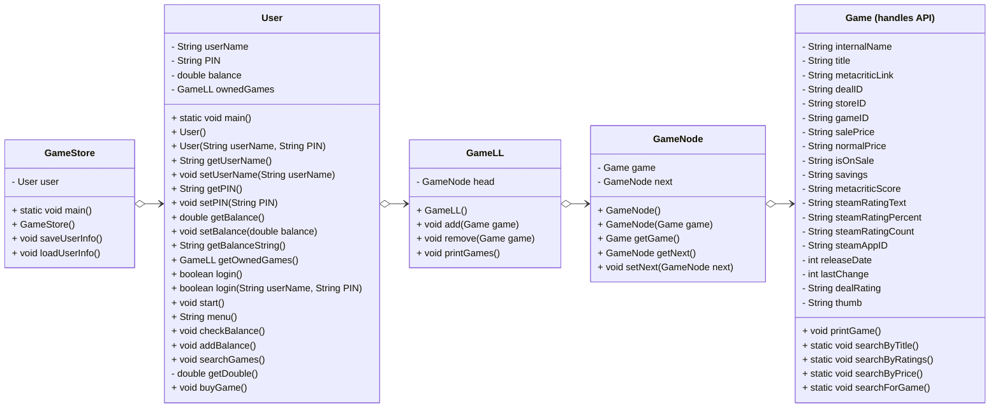

# CS121FinalProject
repo for CS121 final project
# UML Diagram

```mermaid
classDiagram
direction LR
class GameStore {
    - User user
    + static void main()
    + GameStore()
    + void saveUserInfo()
    + void loadUserInfo()
}
class User {
    - String userName
    - String PIN
    - double balance
    - GameLL ownedGames
    + static void main()
    + User()
    + User(String userName, String PIN)
    + String getUserName()
    + void setUserName(String userName)
    + String getPIN()
    + void setPIN(String PIN)
    + double getBalance()
    + void setBalance(double balance)
    + String getBalanceString()
    + GameLL getOwnedGames()
    + boolean login()
    + boolean login(String userName, String PIN)
    + void start()
    + String menu()
    + void checkBalance()
    + void addBalance()
    + void searchGames()
    - double getDouble()
    + void buyGame()
}
class Game ["Game (handles API)"]{
    - String internalName
    - String title
    - String metacriticLink
    - String dealID
    - String storeID
    - String gameID
    - String salePrice
    - String normalPrice
    - String isOnSale
    - String savings
    - String metacriticScore
    - String steamRatingText
    - String steamRatingPercent
    - String steamRatingCount
    - String steamAppID
    - int releaseDate
    - int lastChange
    - String dealRating
    - String thumb
    + void printGame()
    + static void searchByTitle()
    + static void searchByRatings()
    + static void searchByPrice()
    + static void searchForGame()
}
class GameLL {
    - GameNode head
    + GameLL()
    + void add(Game game)
    + void remove(Game game)
    + void printGames()
}
class GameNode {
    - Game game
    - GameNode next
    + GameNode()
    + GameNode(Game game)
    + Game getGame()
    + GameNode getNext()
    + void setNext(GameNode next)
}

GameStore o--> User
User o--> GameLL
GameLL o--> GameNode
GameNode o--> Game
```
